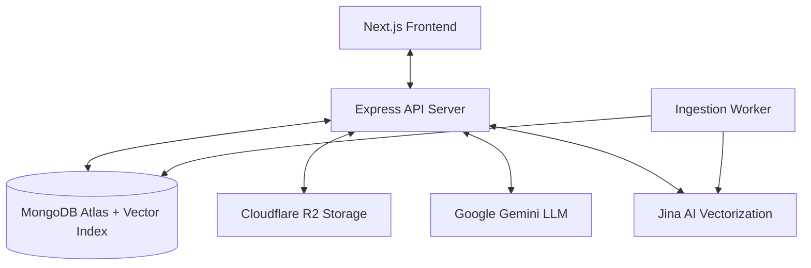

# 🏺 Docu Whisper — Ethereal Archive

**Docu Whisper** is a premium, high-fidelity RAG (Retrieval-Augmented Generation) platform designed for professionals who need to "whisper" to their documents. Built with a focus on aesthetic excellence and advanced linguistic analysis, it allows users to upload, manage, and converse with complex document sets.

## 🚀 Project Overview

Docu Whisper transforms static PDFs and text files into interactive knowledge bases. Unlike standard chat-with-pdf tools, Docu Whisper excels at **Comparative Analysis**, allowing users to contrast information across multiple documents simultaneously using a specialized AI "Comparison Mode".

## 🛠 Tech Stack

### Frontend
- **Framework**: Next.js 14+ (App Router)
- **Styling**: Tailwind CSS with custom Design Tokens.
- **Animations**: Framer Motion for micro-interactions and smooth transitions.
- **Icons**: Lucide React.
- **State Management**: Zustand.

### Backend $(API)$
- **Runtime**: Node.js & Express.
- **Language**: TypeScript.
- **Database**: MongoDB Atlas (Metadata + Vector Search).
- **Storage**: Cloudflare R2 / S3 (Secure physical file storage).
- **Authentication**: JWT-based secure session management.

### AI Stack
- **LLM**: Google Gemini 2.5-Flash (via Vercel AI SDK).
- **Embeddings**: Jina AI `jina-embeddings-v3` (1024-dim late chunking optimized).
- **Reranker**: Jina AI `jina-reranker-v2-base-multilingual`.

### Why this stack?
- **MongoDB Atlas**: Eliminates the need for a separate vector database by providing native `$vectorSearch`, simplifying the architecture.
- **Jina AI**: Chosen for its superior handling of technical and multilingual documents compared to standard embedding models.
- **Gemini**: Provides state-of-the-art context windowing and cost-efficient high-speed reasoning.

---

## 🏗 High-Level Architecture



1.  **Ingestion Flow**: When a document is uploaded, it is stored in R2. A background worker then chunks the text, creates high-dimensional embeddings via Jina AI, and stores them in the MongoDB Vector Index.
2.  **RAG Flow**: Upon user query, the system performs a vector search in MongoDB, passes candidates through Jina's Reranker to find the top 3-5 most relevant snippets, and injects them into the Gemini system prompt for synthesis.

---

## 🔐 Auth & Authorization

- **JWT Approach**: Secure stateless authentication using JSON Web Tokens.
- **Ownership Logic**: Every document and chat session is strictly tied to a `userId`. The backend enforces middleware checks to ensure users can only access their own knowledge bases.
- **Access Control**: API endpoints utilize an `isLoggedIn` middleware to validate tokens before processing operations.

---

## 🤖 AI Agent Design: The "Whisperer"

The AI agent in Docu Whisper is designed as an **Analytical Researcher** rather than a simple chatbot.
- **Context-Aware**: It uses source citations `[[index]]` for every claim, ensuring auditability.
- **Dual-Mode Logic**:
    - **Default Mode**: Optimized for direct information retrieval and concise fact-checking.
    - **Comparison Mode**: Adjusts retrieval depth (Top-12 candidates) and utilizes specialized system prompts to synthesize differences between sources.

---

## ✨ Creative & Advanced Features

Docu Whisper goes beyond basic PDF chat with three flagship features designed for high-density information discovery:

### 1. Multi-Doc Comparison Mode
The heart of Docu Whisper's analytical engine.
- **What it does**: It tells the AI to stop treating documents as isolated islands. It re-tunes the reranker to look for overlapping or conflicting data and provides a synthesis of differences.
- **UI Logic**: Automatically detects when multiple documents are linked to a session and enables the feature, guiding the user toward comparative research.

### 2. Contextual Query Suggestions
- **Purpose**: Lowers the barrier to entry for complex documents by predicting what the user should ask next.
- **Implementation**: After every assistant response, a background task analyzes the context and generates three highly relevant, unique follow-up questions. These are persisted and displayed as interactive "quick-action" buttons.

### 3. Answer Feedback Loop
- **Purpose**: Establishes a mechanism for answer quality improvement and user preference tracking.
- **Implementation**: Every response includes a "thumbs up/down" interface. Feedback is stored atomically in the MongoDB `Chat` schema, allowing for future fine-tuning or RAG retrieval optimization based on user satisfaction.

---

## 📐 Design Decisions & Trade-offs

- **Glassmorphism vs Performance**: We chose a "glassmorphism" aesthetic (*Ethereal Archive*) to create a premium feel. We optimized this by using GPU-accelerated backdrop filters sparingly to ensure performance on mobile.
- **Vector Search Choice**: Using MongoDB Atlas for vectors instead of Pinecone/Milvus was a deliberate decision to reduce technical debt. While Pinecone might offer more specialized features, Atlas is more than sufficient for thousands of document chunks and keeps the data layer unified.
- **Presigned URLs**: For document downloads, we use presigned S3 URLs. This avoids proxying large files through the API server, ensuring the backend stays lightweight.

---

## 🚧 Known Limitations

- **File Size**: Currently optimized for PDFs up to 10MB. Larger files may experience ingestion delays.
- **OCR**: The current ingestion worker relies on text extraction; scanned images without an OCR layer are not yet supported.

---

## ⚙️ Environment Variables

Create a `.env` file in the `api` root. The following variables are required for full functionality:

| Variable                | Description                                         | Example / Default            |
|-------------------------|-----------------------------------------------------|------------------------------|
| `PORT`                  | Port for the Express server.                        | `5000`                       |
| `JWT_SECRET`            | Secret key for signing JSON Web Tokens.             | `your_super_secret_key`      |
| `FRONTEND_URL`          | URL for CORS and redirect logic.                    | `http://localhost:3000`      |
| `MONGODB_URI`           | MongoDB Atlas connection string with vector search. | `mongodb+srv://...`           |
| `GEMINI_API_KEY`        | Google AI API key for Gemini models.                | `AIza...`                    |
| `GEMINI_MODEL`          | Specific Gemini model to use.                       | `gemini-2.5-flash`           |
| `JINA_API_KEY`          | API key for Jina Embeddings and Reranker.           | `jina_...`                   |
| `R2_BUCKET_NAME`        | Cloudflare R2 bucket name.                          | `documents`                  |
| `R2_ACCOUNT_ID`         | Cloudflare account ID.                              | `b0aac659...`                |
| `R2_ACCESS_KEY_ID`      | S3-compatible Access Key.                           | `46d06eaa...`                |
| `R2_SECRET_ACCESS_KEY`  | S3-compatible Secret Key.                           | `3f4256eb...`                |
| `UPSTASH_REDIS_URL`     | Redis URL for rate limiting and task queues.        | `rediss://...`               |

---

## 🚀 How to Deploy

### 1. Backend (API) Deployment
The API is a standard Node.js application. Recommended platforms: **Render**, **Fly.io**, or **Railway**.

**Steps**:
1.  **Environment Variables**: Add all variables from the table above to your provider's "Secrets" or "Environment Variables" section.
2.  **Build Command**: `npm install && npm run build` (if using TS) or simply `npm install`.
3.  **Start Command**: `node dist/api/server.js` (or `npm run serve` if configured).
4.  **Health Check**: Ensure the `/health` endpoint (if implemented) or `/` returns a `200 OK`.

### 2. Database & Vector Index
1.  Deploy a cluster on [MongoDB Atlas](https://www.mongodb.com/atlas).
2.  **CRITICAL**: Create an Atlas Vector Search index named `vector_index` on the `chunks` collection with the following mapping:
```json
{
  "fields": [
    {
      "numDimensions": 1024,
      "path": "embedding",
      "similarity": "cosine",
      "type": "vector"
    },
    {
      "path": "userId",
      "type": "filter"
    }
  ]
}
```

### 3. Storage
1.  Create a bucket in [Cloudflare R2](https://www.cloudflare.com/products/r2/).
2.  Enable **CORS** on the bucket to allow requests from your `FRONTEND_URL`.

---

## 🛠 Setup (Local)
1.  **Clone the repo**: `git clone <repo-url>`
2.  **API**: `cd api && npm install && npm run serve`
3.  **Frontend**: `cd my-app && npm install && npm run dev`

---
*Created by Antigravity for Docu Whisper — v0.1.0*
